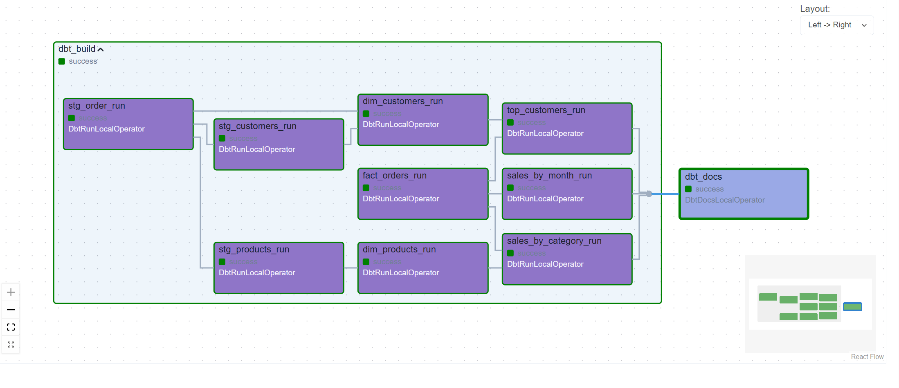

# 🏪 Superstore Data Engineering Project

Build an **end-to-end data pipeline** using **Python, Apache Airflow, dbt, PostgreSQL**, and visualize insights with **Power BI**.

---

## 📌 Project Overview

This project simulates a **real-world retail data platform** for a Superstore business. The goal is to design and implement a **modern data engineering workflow**, from raw data ingestion to analytics-ready datasets and dashboards.

You will see how different tools work together in a production-like environment:

* **Python** for data processing
* **Airflow** for orchestration
* **PostgreSQL** as the data warehouse
* **dbt** for data modeling (ELT)
* **Power BI** for business intelligence

---

## 🏗️ Architecture


---

## 🔧 Tech Stack

| Layer            | Technology              |
| ---------------- | ----------------------- |
| Orchestration    | Apache Airflow          |
| Data Processing  | Python                  |
| Data Warehouse   | PostgreSQL              |
| Transformation   | dbt                     |
| Visualization    | Power BI                |
| Containerization | Docker & Docker Compose |

---

## 📂 Project Structure

```
superstore_project/
│
├── airflow/              # Airflow DAGs & configuration
├── dbt/                  # dbt models, tests, and docs
├── data/                 # Raw input datasets
├── docker/               # Dockerfiles & docker-compose
├── scripts/              # Python ETL scripts
├── dashboards/           # Power BI files
└── README.md
```

---

## 🔄 Data Pipeline Flow

1. **Ingest Raw Data**

   * Load Superstore CSV data using Python
   * Store raw data into PostgreSQL

2. **Orchestration with Airflow**

   * Schedule and manage ETL tasks
   * Trigger dbt models after data load

3. **Transform with dbt**

   * Clean and standardize data
   * Build **staging**, **fact**, and **dimension** tables
   * Apply tests (not null, unique, relationships)

4. **Analytics & BI**

   * Expose star schema tables
   * Connect Power BI to PostgreSQL
   * Build interactive dashboards

---

## 🧠 Data Model (Star Schema)

* **Fact Table**

  * `fact_orders`

* **Dimension Tables**

  * `dim_customers`
  * `dim_products`
  * `dim_categories`
  * `dim_dates`
  * `dim_regions`

This structure enables fast and flexible analytical queries.


---

## 📊 Dashboard Preview (Power BI)

> Example insights:

* Sales & profit trends over time

* Top customers and products

* Performance by region and category


---

## 🚀 How to Run the Project

### 1️⃣ Clone the repository

```bash
git clone https://github.com/havietquang/superstore_project.git
cd superstore_project
```

### 2️⃣ Start services with Docker

```bash
docker-compose up -d
```

### 3️⃣ Access Airflow

* URL: [http://localhost:8080](http://localhost:8080)
* Trigger the DAG to run the pipeline

### 4️⃣ Run dbt models (optional manual run)

```bash
dbt run
dbt test
```

### 5️⃣ Open Power BI

* Connect to PostgreSQL
* Load analytics tables
* Explore dashboards

---

## 🎯 Learning Outcomes

* Design a real-world **data pipeline**
* Understand **Airflow + dbt** integration
* Apply **data modeling (star schema)**
* Deploy a containerized data platform
* Build BI dashboards for decision-making

---

## 📌 Future Improvements

* Add data quality checks (Great Expectations)
* Incremental models in dbt
* CI/CD for dbt & Airflow
* Cloud deployment (AWS / GCP)

---

## 👤 Author

**Ha Viet Quang**
Aspiring Data Engineer | Python • Airflow • dbt • SQL

---